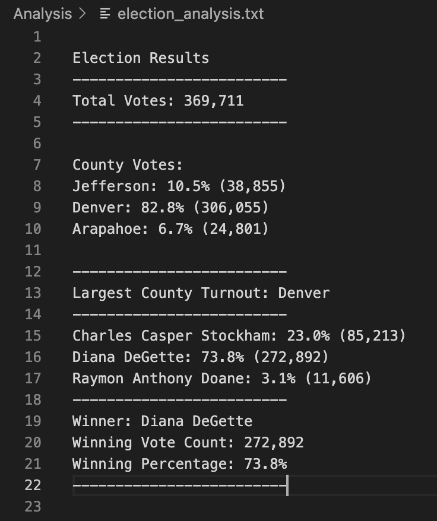

# Election_Analysis
## Overview of Election Audit
### Purpose
Tom, a Colorado Board of Elections employee, asked me to assist in the audit of a recent local congressional election. Specifically, I was asked to assist in determining the total number of votes, the total number and percentage of votes for each candidate, as well as the winner of the election based on the popular vote. The election commission requested additional data to complete the audit, including the voter turnout for each county, the percentage of votes for each county out of the total count, and the county with the highest turnout.  
Tom’s manager additionally wanted to know if there was a way to automate this process using Python to be used in other elections.

In this project, the final Python script needed to be able to deliver the following information when run: 
•	Total number of votes cast
•	A complete list of candidates who received votes
•	Total number of votes each candidate received
•	Percentage of votes each candidate won
•	The winner of the election based on popular vote
•	The voter turnout for each county
•	The percentage of votes from each county out of the total count
•	The county with the highest turnout
## Resources
-	Data Source: election_results.csv
-	Software: Python 3.6.1, Visual Studio Code 1.38.1

## Analysis 
To start, I created an indirect path to my csv file by importing the dependencies csv and os and declaring a file to load using the os.path.join() function. I additionally created a path for my text file to be saved. My code looked as follows:
```
# Add our dependencies.
import csv
import os
# Assign a variable to load a file from a path.
file_to_load = os.path.join("Resources", "election_results.csv")
# Assign a variable to save the file to a path.
file_to_save = os.path.join("analysis", "election_analysis.txt")
```
Next, I opened the election results using a with statement: 
```
# Open the election results and read the file.
with open(file_to_load) as election_data:
```
To read the file, I used the reader function: 
```
    # Read the file object with the reader function.
    file_reader = csv.reader(election_data)
```
I used the next() method to skip the header row of the CSV file and then iterated through the file to print each row: 
```
    # Read the header row.
    headers = next(file_reader)

    # Print each row in the CSV file.
    for row in file_reader:
        print(row)
```

### Total Votes
To get the total number of votes cast in the election, I initialized a variable called “total_votes” to zero. This variable was placed above the code where I opened the file. 
```
# 1. Initialize a total vote counter.
total_votes = 0
```
Following the for loop, I added a line to increment the “total_volumes” by 1: 
```
    # Print each row in the CSV file.
    for row in file_reader:
        # 2. Add to the total vote count.
        total_votes += 1
```
Next, I added a line to print out the total votes:
```
# 3. Print the total votes.
print(total_votes)
```

### Candidates in the Election
To determine the candidates in the election, I declared a new list “candidate_options = []” before my with open () statement. 
```
# Candidate Options
candidate_options = []
```
Then, using indexing on the for loop variable row, I added the following code to get the candidate’s name from the row within the for loop:
```
    # Print each row in the CSV file.
    for row in file_reader:
        #Add to the total vote count.
        total_votes += 1
        # Print the candidate name from each row.
        candidate_name = row[2]
        
```
Subsequently, I added the candidate_name to the candidate_options list using the append() method:
```
        # Add the candidate name to the candidate list.
        candidate_options.append(candidate_name)
```
Finally, I added a print statement to print out the candidate_options list:
```
# Print the candidate list.
print(candidate_options)
```
As this produced a list of every candidate from each row, I created an if statement to check if the candidate has been added to the candidate_options list. The updated code for the for loop looked as follows:
```
    # Print each row in the CSV file.
    for row in file_reader:
        #Add to the total vote count.
        total_votes += 1
        # Print the candidate name from each row.
        candidate_name = row[2]
        # If the candidate does not match any existing candidate...
        if candidate_name not in candidate_options:
            # Add it to the list of candidates.
            candidate_options.append(candidate_name)
```

### Candidate’s Votes
To count the votes for each candidate, I first created a dictionary to link votes with a candidate, with the key as each candidate’s name and the vote count for the candidate as the value for the key. Thus, I declared an empty dictionary “candidate_votes = {}” before the with open() statement: 
```
# Declare the empty dictionary.
candidate_votes = {}
```
Inside the if statement I instantiated a candidate as a key for the dictionary by using the “dictionary_name[key]” format and set each candidate’s vote count to zero: 
```
        if candidate_name not in candidate_options:
            # Add it to the list of candidates.
            candidate_options.append(candidate_name)
            #Begin tracking that candidate's vote count.
            candidate_votes[candidate_name] = 0
```
Next, I incremented the votes by 1 for each time a candidate’s name appeared in a row, placing the code inside the for loop and in alignment with the if statement as follows:
```
    for row in file_reader:
        #Add to the total vote count.
        total_votes += 1
        # Print the candidate name from each row.
        candidate_name = row[2]
        # If the candidate does not match any existing candidate...
        if candidate_name not in candidate_options:
            # Add it to the list of candidates.
            candidate_options.append(candidate_name)
            #Begin tracking that candidate's vote count.
            candidate_votes[candidate_name] = 0
        # Add a vote to that candidate's count.
        candidate_votes[candidate_name] += 1
```
Finally, I added code to print the candidate vote dictionary:
```
# Print the candidate vote dictionary.
print(candidate_votes)
```

### Candidate’s Percentage of Votes
To determine the percentage of votes each candidate received, I needed to divide the candidate votes by the total vote count and then multiply by 100. However, the votes and total_votes were integers and needed to first be converted to floating-point decimal numbers. 

To begin, I used a for loop to iterate through the “candidate_options = []” list to get the candidate’s name and used the for loop variable to retrieve the votes for that candidate from the “candidate_votes = {}” dictionary. This code was added below the line “candidate_votes[candidate_name] += 1”. 
```
    for candidate_name in candidate_votes:
        #Retrieve vote count of a candidate.
        votes = candidate_votes[candidate_name]
```
Then, I inserted an equation to calculate the percentage of the vote count and used f-string formatting to print each candidate and their percentage of votes to one decimal place: 
```
        #Calculate the percentage of votes.
        vote_percentage = float(votes) / float(total_votes) * 100
        #Print the candidate name and percentage of votes.
        print(f"{candidate_name}: received {vote_percentage:.1f}% of the vote.")
```

### The Winning Candidate
To determine the winning candidate, vote count, and percentage, I planned to loop through the vote counts using an if statement to check if the first vote count for a candidate was greater than zero, and if true, then that vote count would equal the “winning count” and the candidate’s percentage of the vote would be the “winning percentage”. The “winning candidate” would then be selected from the “candidate_options” list. To do this, I declared three variables before my with open() statement: “winning_candidate” as an empty string, “winning_count” equal to zero, and “winning_percentage” equal to zero. 
```
# Winning Candidate and Winning Count Tracker
winning_candidate = ""
winning_count = 0
winning_percentage = 0
```
Within the for loop, I created an if statement to determine whether the vote count was greater than the winning_count and the percentage was greater than the winning_percentage. If true, the winning_count was set equal to the votes and the winning_percentage was set equal to the vote_percentage. Then the winning_candidate was set equal to the candidate_name: 
```
    # Iterate through the candidate list.
    for candidate_name in candidate_votes:
        #Retrieve vote count of a candidate.
        votes = candidate_votes[candidate_name]
        #Calculate the percentage of votes.
        vote_percentage = float(votes) / float(total_votes) * 100
        # Determine winning vote count and candidate
        # Determine if the votes are greater than the winning count.
        if (votes > winning_count) and (vote_percentage > winning_percentage):
            # If true then set winning_count = votes and winning_percent = vote_percentage.
            winning_count = votes
            winning_percentage = vote_percentage
            # Set the winning_candidate equal to the candidate's name.
            winning_candidate = candidate_name
```
Above this new if statement, I added the following code to print out each candidate’s name, vote count, and percentage of votes:
```
        # Print out each candidate's name, vote count, and percentage of votes to the terminal.
        print(f"{candidate_name}: {vote_percentage:.1f}% ({votes:,})\n")
```
I also added another print code following the if statement and in alignment with the for loop to print out the winning candidate summary: 
```
    winning_candidate_summary = (
        f"-------------------------\n"
        f"Winner: {winning_candidate}\n"
        f"Winning Vote Count: {winning_count:,}\n"
        f"Winning Percentage: {winning_percentage:.1f}%\n"
        f"-------------------------\n")
    print(winning_candidate_summary)
```

### Write the Election Results to a Text File
I modified my code to write the election results to a text file by inserting a with statement to open the text file: 
```
        # Save the results to our text file.
        with open(file_to_save, "w") as txt_file:
```
All code remaining was indented below this statement. 

Below the with open statement, an f-string literal message was added to create titles within the text file: 
```
        # Print the final vote count to the terminal.
            election_results = (
                f"\nElection Results\n"
                f"-------------------------\n"
                f"Total Votes: {total_votes:,}\n"
                f"-------------------------\n")
            print(election_results, end="")
            # Save the final vote count to the text file.
            txt_file.write(election_results)
```
### Writing the Candidate’s Results to a Text File
Within the print() function established earlier for the candidate results, the code was replaced with a variable “candidate_results” by first equating “candidate_results” to the formula originally within the print() function: 
```
                # Print out each candidate's name, vote count, and percentage of votes to the terminal.
                candidate_results = (f"{candidate_name}: {vote_percentage:.1f}% ({votes:,})\n")
                print(candidate_results)
```
Then, the following code was added to save the “candidate_results” to the “election_analysis.txt” file: 
```
                #  Save the candidate results to our text file.
                txt_file.write(candidate_results)
```
### Writing the Winning Candidate’s Results to a Text File
At the end of my coding file below the print() function, I added a line to save the “winning_candidate_summary” to the text file: 
```
            # Save the winning candidate's name to the text file.
            txt_file.write(winning_candidate_summary)
```
### Voter Turnout and Percentage of Votes for each County
To begin this portion of the analysis I initialized a county list that would hold the names of the counties and a dictionary that would hold the county as the key and the votes cast for each county as the values: 
```
# Create a county list and county votes dictionary.
county_options = []
county_votes = {}
```
Next, I initialized an empty string to hold the county name with the highest turnout and a variable to hold the number of votes of the county with the highest turnout: 
```
#Track the largest county and county voter turnout.
highest_turnout_county = ""
highest_turnout = 0
```
Within the for loop, I added a script to collect the county name for each row. As the counties were located within the second column of the CSV file, I used the index 1 within my script:
```
        #Extract the county name from each row.
        county_name = row[1]
```
Then, I wrote an if statement to check if the county_name for that row is in the county_options list. I used the append() method to add the county_name to the county_options list if the county_name was not in the county_options list. Then, I initialized the county_votes to zero to begin tracking the vote counts for each county.
```
         # Write an if statement that checks that the county does not match any existing county in the county list.
        if county_name not in county_options:

            # Add the existing county to the list of counties.
            county_options.append(county_name)

            # Begin tracking the county's vote count.
            county_votes[county_name] = 0
```
Below this script, and in alignment with the if statement, I added a line that increases the county’s vote count by 1 as the code loops through all the rows:
```
        # Add a vote to that county's vote count.
        county_votes[county_name] += 1
```
To get the county_name from the county_votes dictionary, I created a for loop:
```
    # Write a for loop to get the county from the county dictionary.
    for county_name in county_votes:
```
I then initialized the variable “c_votes” to hold the county’s votes as they were retrieved from the county votes dictionary: 
```
        # Retrieve the county vote count.
        c_votes = county_votes.get(county_name)
```
This value was inputted into the percentage equation used earlier to calculate the percentage of votes for the county:
```
        # Calculate the percentage of votes for the county.
        c_vote_percentage = float(c_votes) / float(total_votes) * 100
```
Next, I wrote a print statement to print the current county, its percentage of the total votes, and its total votes to the command line: 
```
         # Print the county results to the terminal.
        county_results = (f"{county_name}: {c_vote_percentage:.1f}% ({c_votes:,})\n")
        print(county_results)
```
Below this statement, I wrote a script that saves these results to the election_resuls.txt file: 
```
         # Save the county votes to a text file.
        txt_file.write(county_results)
```
To determine the county with the largest vote count, I created an if statement within the for loop to determine whether the county vote count was greater than the highest_turnout. If true, the highest_turnout was set equal to the county votes and highest_turnout_county was set equal to the county_name:
```
         # Write an if statement to determine the winning county and get its vote count.
        if (c_votes > highest_turnout):
            highest_turnout = c_votes
            highest_turnout_county = county_name
```
Following this script I added a print statement to print the county with the largest turnout:  
```
    # Print the county with the largest turnout to the terminal.
    highest_turnout_county_summary = (
        f"\n-------------------------\n"
        f"Largest County Turnout: {highest_turnout_county}\n"
        f"-------------------------\n")
    print(highest_turnout_county_summary)
```
Finally, I wrote a script that saves the county with the largest turnout to the election_results.txt file:
```
    # Save the county with the largest turnout to a text file.
    txt_file.write(highest_turnout_county_summary)
```

## Election Audit Results



1.	How many votes were cast in this congressional election?
    - A total of 368,711 votes were cast in this congressional election.
2.	Provide a breakdown of the number of votes and the percentage of total votes for each county in the precinct.
    - Three counties participated in this election: Jefferson, Denver, and Arapahoe. Jefferson had a vote count of 38,855, or 10.5% of the total vote. Denver had a vote count of 306,055, or 82.8% of the total vote. Arapahoe had a vote count of 24,801, or 6.7% of the total vote. 
3. Which county had the largest number of votes?
    - Denver was the county with the largest number of votes.
4. Provide a breakdown of the number of votes and the percentage of the total votes each candidate received.
     - There were three candidates: Charles Casper Stockham, Diana DeGette, and Raymon Anthony Doane. Charles Casper Stockham received 85,213 votes, Diana DeGette received 272,892 votes, and Raymon Anthony Doane received 11,606 votes. Charles Casper Stockham received 23.0% of the total vote, Diana DeGette received 73.8% of the total vote, and Raymon Athony Doane received 3.1% of the total vote.
5. Which candidate won the election, what was their vote count, and what was their percentage of the total votes?
    - The winning candidate was Diana DeGette, with a winning vote count of 272,892 votes and a winning percentage of 73.8% of votes.

## Election Audit Summary
Due to the simplicity of this script and analysis, this script can be used for any election, such as the federal election. If using this script to audit a federal election, only the slight modification of changing counties to states would be needed. Furthermore, votes from an election are often received by mail-in ballots, punch cards, or direct recording electronic. This script can be easily modified to create a list of the types of election methods as was done for the list of candidate names, and modified to create a dictionary of the votes per method. Then, the script can be used to determine which methods had the highest votes and thus which method was used most often. 
